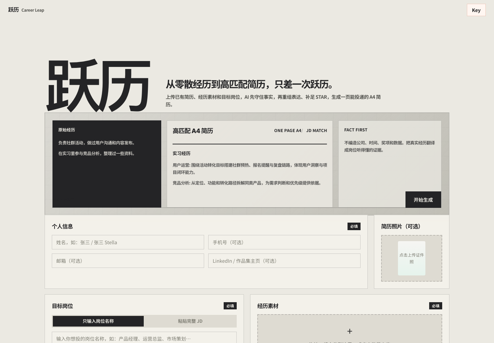
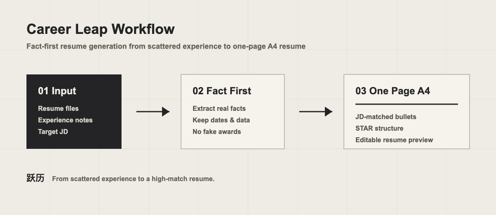

# 跃历 Career Leap

从零散经历到高匹配简历，只差一次跃历。

跃历是一个纯前端 AI 简历生成工具。用户可以上传已有简历、经历素材和目标岗位，工具会基于真实事实重组表达、补足 STAR，并生成一页能投递的 A4 简历。



## How It Works



1. 上传已有简历、经历素材和目标岗位 JD。
2. AI 先拆解真实事实，保留学校、公司、岗位、时间、奖项和数据。
3. 再根据目标岗位重组经历表达，补足 STAR，生成一页 A4 简历。
4. 生成后可以继续查看 JD 匹配度、选中文字改写、下载 PDF 或回退历史版本。

## Features

- 目标岗位 / 完整 JD 输入
- PDF、DOCX、TXT、MD 经历素材批量上传
- 简历照片手动上传
- DeepSeek API 生成中文 / 英文结构化简历
- 事实优先机制：不编造公司、时间、奖项、数据和技能
- 实习经历、项目经历、创业 / 校园经历自动分类
- 一页 A4 简历预览与 PDF / PNG 下载
- 选中文字 AI 改写
- JD 匹配度评分
- 历史版本回退

## Agent Skill

如果你不想使用网页工具，也可以把跃历的简历写作方法直接交给 Agent 使用：

- [Yueli Resume Writer Skill](skills/yueli-resume-writer/README.md)
- [Formal Skill File](skills/yueli-resume-writer/SKILL.md)

这个 Skill 会指导 Agent 按“事实优先 -> 岗位转译 -> 经历筛选 -> STAR 重写 -> 版面校验”的流程写简历，适合产品、运营、市场、咨询、投资人实习生、校招等方向。

## Tech Stack

- HTML
- CSS
- Vanilla JavaScript
- DeepSeek Chat Completions API
- Vercel Serverless Function API proxy
- pdf.js
- mammoth.js
- Tesseract.js

## Local Development

```bash
python3 -m http.server 8788
```

Then open:

```text
http://localhost:8788
```

## Online Access

- Full app on Vercel: <https://resume-tool-ochre-one.vercel.app>
- GitHub Pages mirror: <https://wangranm-a11y.github.io/yueli-career-leap/>

The GitHub Pages version is a static mirror for easier viewing and sharing. Because GitHub Pages cannot host private server-side environment variables, AI generation still calls the Vercel serverless API proxy, or the user can provide their own DeepSeek API Key in the browser.

## Deploy

This project is a static website and can be deployed to Vercel, Netlify, GitHub Pages, or any static hosting service.

Vercel:

```bash
npx vercel@latest env add DEEPSEEK_API_KEY production
npx vercel@latest --prod
```

## Privacy

The production site can use `DEEPSEEK_API_KEY` from Vercel environment variables through a serverless proxy. The key is not included in the source code and is not exposed to the browser.

Users can still optionally provide their own DeepSeek API Key in the browser. That custom key is saved in `localStorage` only.

Uploaded resume files are parsed in the browser. The extracted text is sent to the model only when the user generates or rewrites a resume.

## License

MIT
